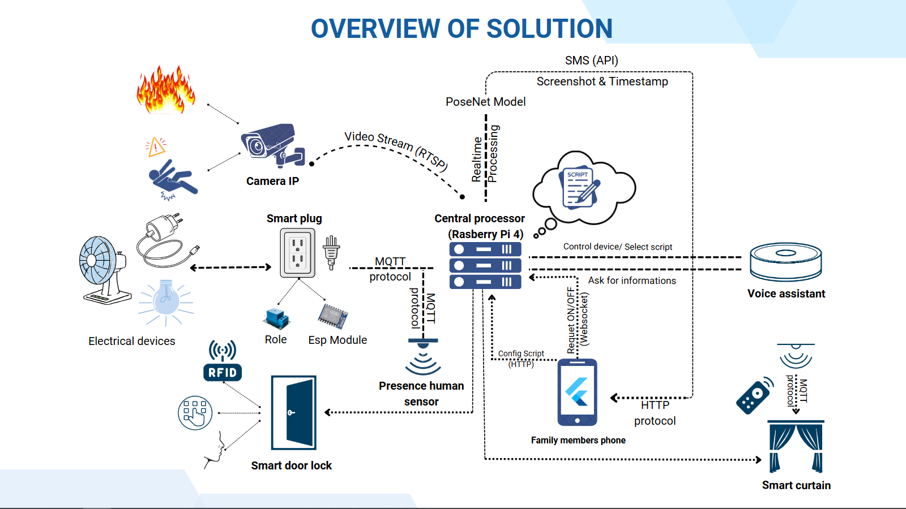

# IoT IoTChallenge 2024 by Rcuet Team

This repository contains the source code for our smart home project developed for the IoT IoTChallenge 2024 contest. The project encompasses various smart home functionalities, including smart locks, smart switches, image recognition for fire and fall detection, a chatbot, and a Flutter application for system control and management.

## Project Overview

### Features

1. **Smart Locks**
   - **Password:** Secure your home with a customizable password.
   - **RFID:** Use RFID tags for convenient and secure access.
   - **Face ID:** Utilize facial recognition for advanced security.

2. **Smart Switches**
   - Control your home appliances remotely through smart switches.

3. **Image Recognition**
   - **Fire Detection:** Detect fire incidents in real-time using camera feeds.
   - **Fall Detection:** Monitor and detect falls to ensure the safety of individuals.

4. **Chatbot**
   - An interactive chatbot for assisting users with smart home operations and providing information.

5. **Flutter Application**
   - A user-friendly Flutter app to control and interact with the entire smart home system.

### Components

- **ESP32:** Microcontroller used for various IoT functionalities.
- **MQTT:** Protocol used for communication between devices.
- **MongoDB:** Database used for storing and managing data.

### Code Structure

- [**Firmware:**](Devices) Code for ESP32 handling smart lock mechanisms and smart switches.
- [**ImageRecognition:**](ImageRecognition) Scripts for fire and fall detection and face recognition using camera feeds.
- [**Chatbot:**](DialogflowCX) Code for the chatbot functionality.
- [**FlutterApp:**](MobileApp) Flutter application code for controlling the smart home system.
- [**Server:**](HttpServer) Backend server code for managing data and device interactions.

## Acknowledgements
* Thanks to the IoT Challenge 2024 organizers for providing this platform.
* Special thanks to the Rcuet team members for their hard work and dedication.

## Note
This code was developed for the IoT Challenge 2024 contest and is not fully polished. It is intended for personal memory storage and may not be suitable for production use.
